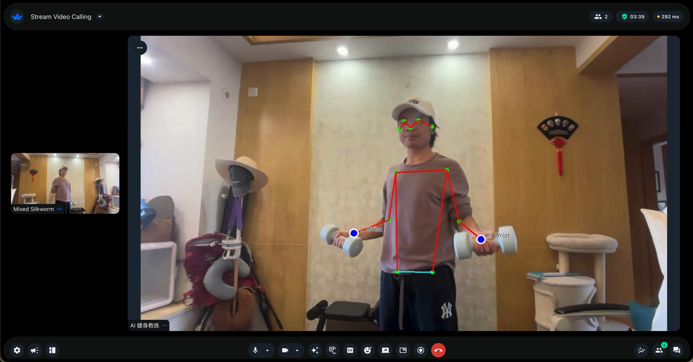

# Vision Agent Real Demo 🤖💪

> **Professional AI Fitness Coach** powered by real-time vision AI, pose detection, and voice feedback

[](https://www.python.org/downloads/)
[](https://github.com/GetStream/Vision-Agents)
[](https://opensource.org/licenses/MIT)
[](https://github.com/ultralytics/ultralytics)

**[中文文档](./docs/README_CN.md)** | **[Quick Start](./docs/QUICKSTART.md)** | **[Troubleshooting](./docs/TROUBLESHOOTING.md)**

---

## 🎯 What is this?

A **real-time AI fitness coach** that uses computer vision and voice AI to guide your workouts. Built on the official [GetStream/Vision-Agents](https://github.com/GetStream/Vision-Agents) framework, it combines:

- 🎥 **Real-time video analysis** via local BrowserEdge WebRTC
- 🦴 **Pose detection** with YOLO 11 tracking 17 body keypoints
- 🧠 **AI coach** powered by Qwen Realtime (DashScope)
- 🗣️ **Voice feedback** for instant form correction and encouragement

### Watch it in action

<p align="center">
  
</p>

> *AI coach analyzing a squat in real-time, detecting knee alignment and providing instant feedback*

---

## ✨ Features

### 🏋️ Professional Fitness Coaching

- **5 Core Exercises** with detailed form analysis
  - Squats - Lower body strength king
  - Push-ups - Upper body compound movement
  - Planks - Core stability foundation
  - Lunges - Single-leg balance and power
  - Crunches - Abdominal core training

- **Real-time Form Correction**
  - Detects 17 body keypoints
  - Calculates joint angles
  - Identifies common mistakes (knee valgus, lower back arch, etc.)
  - Instant voice feedback

- **Progressive Training**
  - Difficulty levels: Beginner → Intermediate → Advanced
  - Rep counting with quality standards
  - Personalized suggestions based on your performance

### 🔬 Technical Excellence

- **Low-latency local media** - BrowserEdge WebRTC with browser AEC
- **Accurate Pose Detection** - YOLO 11 Pose (17 keypoints)
- **Multimodal AI** - Qwen Realtime (vision + audio)
- **Auditable motion facts** - YOLO Pose plus a local squat FSM and SQLite memory foundation

---

## 🚀 Quick Start

### Prerequisites

- Python 3.13 (the lockfile targets Python 3.13; Python 3.14 is not supported)
- A Chromium-based browser with camera/microphone permissions
- A DashScope API key with Qwen Realtime access ([create one](https://bailian.console.aliyun.com/))
- macOS/Linux for the Tk desktop entry point (Windows can use `scripts/run.bat`)

### Installation

```bash
# 1. Clone the repository
git clone https://github.com/MindDock/vision-agent-real-demo.git
cd vision-agent-real-demo

# 2. Install uv (the project dependency manager)
curl -LsSf https://astral.sh/uv/install.sh | sh

# 3. Install the locked Python 3.13 environment
uv sync --locked

# 4. Configure the Qwen Realtime key
cp .env.example .env
nano .env  # set DASHSCOPE_API_KEY; other keys are optional/legacy

# 5. Run the local coach
./run.sh
```

`run.sh` first runs `scripts/check_local_setup.py` (it never prints key values), then starts
`agent_local.py`. The desktop window opens a BrowserEdge page; allow camera and microphone
access there. The first run downloads `yolo11n-pose.pt` if it is not already present.
The controller writes authoritative YOLO/FSM motion facts to the SQLite ledger configured by
`COACH_MEMORY_DB` (default `coach_memory.sqlite3`) under `COACH_USER_ID` (default `local-user`).
The desktop path currently does not auto-start the optional MCP stdio server or the Agent Loop.

To run without a live camera or cloud call, use the offline checks:

```bash
.venv/bin/python -m unittest discover -s tests -v
.venv/bin/python scripts/smoke_pose.py --device cpu
.venv/bin/python scripts/smoke_browser_aec.py --pose --pose-device cpu
```

For the optional MCP diagnostic process:

```bash
.venv/bin/python -m coach.mcp_server --db coach_memory.sqlite3 --user-id local-user
```

It waits for an MCP client over stdio; it is not a web server and is not required by the desktop UI.

📖 **Detailed guide**: See [docs/QUICKSTART.md](./docs/QUICKSTART.md)

---

## 🎬 How It Works

```
┌─────────────┐         ┌──────────────┐         ┌─────────────┐
│  Your       │  WebRTC │ Stream Edge  │ Process │ Python      │
│  Browser    │────────▶│  Network     │────────▶│  Agent      │
│  (Camera)   │         │ (< 30ms)     │         │             │
└─────────────┘         └──────────────┘         └──────┬──────┘
                                                        │
                                                        ▼
                                          ┌─────────────────────┐
                                          │ YOLO Pose Detection │
                                          │ (17 keypoints)      │
                                          └──────────┬──────────┘
                                                     │
                                                     ▼
                                          ┌─────────────────────┐
                                          │ Qwen Realtime       │
                                          │ (Vision + Voice)    │
                                          └──────────┬──────────┘
                                                     │
                                                     ▼
                                          ┌─────────────────────┐
                                          │ Voice Feedback      │
                                          │ "Knees out!"        │
                                          └─────────────────────┘
```

### Architecture

1. **Video Capture** - Your webcam streams video via WebRTC
2. **Local transport** - BrowserEdge provides WebRTC and browser AEC
3. **Pose Detection** - YOLO extracts 17 body keypoints per frame
4. **AI Analysis** - Qwen Realtime handles audio/video; local FSM owns rep counts
5. **Voice Coaching** - Real-time audio feedback guides your form

---

## 🏃 Usage Examples

### Starting a Workout

```
You: "I want to do squats"
AI: "Great! Stand with feet shoulder-width apart, toes slightly out.
     I'll watch your form. Ready? Start!"

[You perform a squat]
AI: "Good depth! But watch your knees - they're caving in slightly.
     Push them outward. Let's try another one!"

[You adjust and do another]
AI: "Perfect! That's rep 1. Knees aligned, depth good. Keep it up!"
```

### Real-time Corrections

```
[During push-up]
AI: "Hold on - your hips are sagging. Tighten your core!
     Think of your body as a straight plank from head to heels."

[You correct the form]
AI: "Much better! That's the way. Keep breathing - down on inhale,
     up on exhale."
```

### Training Plan Suggestion

```
You: "What should I train today?"
AI: "Based on last session, let's focus on lower body:
     • Squats: 3 sets × 12 reps
     • Lunges: 3 sets × 10 reps each leg
     • Plank: 3 sets × 45 seconds

     Ready to start?"
```

---

## 📊 What the AI Sees

### YOLO Keypoints (17 detected)

```
1. Nose
2-3. Left Eye, Right Eye
4-5. Left Ear, Right Ear
6-7. Left Shoulder, Right Shoulder
8-9. Left Elbow, Right Elbow
10-11. Left Wrist, Right Wrist
12-13. Left Hip, Right Hip
14-15. Left Knee, Right Knee
16-17. Left Ankle, Right Ankle
```

### AI Analysis Metrics

- ✅ **Joint Angles** - Knee, elbow, hip flexion
- ✅ **Body Alignment** - Shoulder-hip-knee-ankle line
- ✅ **Movement Depth** - Squat depth, push-up range
- ✅ **Error Detection** - Knee valgus, back arch, etc.
- ✅ **Quality Scoring** - A/B/C/D grade per rep

---

## 🛠️ Configuration

### Adjust Performance

Set these values in `.env` before starting:

```dotenv
YOLO_DEVICE=mps       # use cpu when MPS is unavailable
QWEN_REALTIME_MODEL=qwen3.5-omni-plus-realtime
QWEN_VOICE=Ethan
```

### Customize AI Behavior

Edit `docs/COACHING_INSTRUCTIONS.md` to change:
- Coaching style (strict/encouraging/technical)
- Exercise focus (strength/cardio/flexibility)
- Feedback verbosity (concise/detailed)

The local entry point currently uses Qwen Realtime through DashScope. The old Gemini/Stream
examples in earlier release notes are retained for historical context and are not required
by `agent_local.py`.

For a source checkout, use `./run.sh` after `uv sync --locked`; this starts the Tk desktop
controller. The package metadata also includes `agent_local.py` and `agent_local_agent.py` so
building a wheel does not reference the removed `vision_agent_demo.py` entry point.

---

## 📁 Project Structure

```
vision-agent-real-demo/
├── agent_local.py             # Tk desktop entry point
├── agent_local_agent.py       # Session lifecycle and Qwen/YOLO wiring
├── docs/COACHING_INSTRUCTIONS.md # AI coaching instructions
├── pyproject.toml             # Dependencies
├── .env.example               # API key template
│
├── docs/
│   ├── README_CN.md           # Chinese documentation
│   ├── QUICKSTART.md          # Quick start guide
│   ├── TROUBLESHOOTING.md     # Common issues
│   └── images/                # Screenshots and demos
│
├── scripts/
│   ├── run.sh                 # Start script (macOS/Linux)
│   ├── run.bat                # Start script (Windows)
│   ├── setup.sh               # Setup script
│   └── check_local_setup.py   # Qwen/YOLO environment checker
│
└── tests/
    └── ...                     # Offline and browser loopback tests
```

---

## 🤝 Contributing

We welcome contributions! Here's how you can help:

### Areas for Improvement

- 🎨 **Add AR visualization** - Draw skeleton overlay on video
- 🏃 **More exercises** - Add burpees, pull-ups, yoga poses
- 🌍 **Internationalization** - Support more languages
- 📱 **Mobile app** - iOS/Android native apps
- 🎯 **Custom training plans** - Weekly programs, goals
- 📊 **Progress tracking** - Save history, show improvement

### How to Contribute

1. Fork the repository
2. Create a feature branch (`git checkout -b feature/amazing-feature`)
3. Commit your changes (`git commit -m 'Add amazing feature'`)
4. Push to the branch (`git push origin feature/amazing-feature`)
5. Open a Pull Request

See [CONTRIBUTING.md](./CONTRIBUTING.md) for detailed guidelines.

---

## 📝 License

This project is licensed under the MIT License - see the [LICENSE](./LICENSE) file for details.

---

## 🙏 Acknowledgments

- **[GetStream/Vision-Agents](https://github.com/GetStream/Vision-Agents)** - Official framework
- **[Ultralytics YOLO](https://github.com/ultralytics/ultralytics)** - Pose detection model
- **[Qwen Realtime](https://help.aliyun.com/zh/model-studio/realtime)** - Multimodal AI
- **BrowserEdge/WebRTC** - Local browser media transport

---

## 📞 Support

- 📖 **Documentation**: [docs/](./docs/)
- 🐛 **Bug Reports**: [GitHub Issues](https://github.com/MindDock/vision-agent-real-demo/issues)
- 💬 **Discussions**: [GitHub Discussions](https://github.com/MindDock/vision-agent-real-demo/discussions)
- 📧 **Email**: support@minddock.com

---

## 🌟 Star History

If you find this project useful, please consider giving it a star! ⭐

[](https://star-history.com/#MindDock/vision-agent-real-demo&Date)

---

## 📈 Roadmap

- [x] Core fitness coaching (5 exercises)
- [x] Real-time pose detection
- [x] Voice feedback system
- [ ] AR skeleton visualization
- [ ] Progress tracking dashboard
- [ ] Custom workout plans
- [ ] Mobile app (iOS/Android)
- [ ] Multi-language support
- [ ] Social features (share workouts)
- [ ] Advanced analytics

---

<p align="center">
  <strong>Built with ❤️ by <a href="https://github.com/MindDock">MindDock</a></strong>
</p>

<p align="center">
  <sub>Powered by Vision-Agents • YOLO • Qwen Realtime • BrowserEdge</sub>
</p>
