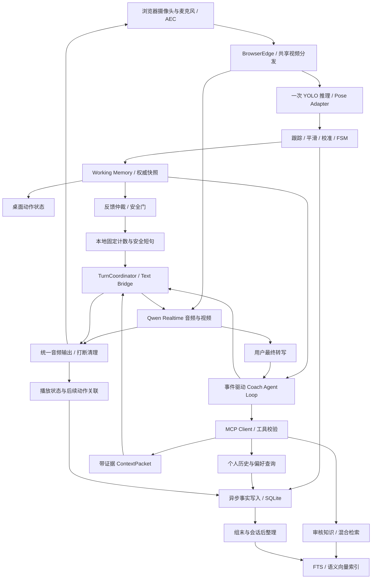

# 教练 Agent：Agent Loop、短期记忆、长期记忆、MCP 与 RAG

版本：设计草案 v1，2026-09-07。适用基线：桌面 Tk + BrowserEdge AEC + Vision-Agents 0.6.9 + Qwen Realtime + YOLO11 Pose。

本文所有新增模块、字段、参数、性能指标均为拟实施设计，不能据此认定功能已存在。现状与风险见[项目审查](./PROJECT_REVIEW_2026_09_07.md)。

逐阶段任务与本轮实际交付状态见[可执行实施路线](./COACH_IMPLEMENTATION_ROADMAP.md)。以该文档的测试记录区分已实现能力和本文中的后续设计。

## 1. 目标与首版边界

系统需要完成这样的闭环：观察这次训练，结合近期动作、历史训练与知识选择建议，执行一次反馈，继续观察是否发生变化，把可靠证据保存到下次训练。

首版支持一个明确选择的用户档案、单人固定机位、深蹲，运动内核独立计数。LLM 负责理解用户目标、提出查询与训练建议、组织表达。YOLO 提供关键点观测，几何与 FSM 产生动作事实。二者通过带来源的数据融合，不允许模型回复覆盖已确认的计数。

验收用例：

1. 完成 10 次动作，其中 2 次质量未达当前规则；账本保存 `completed=10, valid=8`，每次都有指标及规则版本。
2. 询问“刚才第 3 个为什么提醒我”，能定位对应动作、反馈及数值，不依赖重看整段视频。
3. 重启后询问“比上次稳定吗”，查询同动作、同可比较条件的记录，给出指标及样本数；无匹配历史时明确无依据。
4. 用户说“膝盖疼”时先暂停训练并短句回应；检索、模型推理和历史摘要均不能阻挡暂停。
5. 第二人进入画面，暂停计数和用户归属不明的数据写入；重新确认主人体后再恢复。
6. 删除训练历史后，数据库、检索索引、缓存和新会话上下文都不再使用这些数据。

默认不长期保存原始音视频。姿态坐标也属于个人数据，持久化范围由用户选择；允许只留单次动作统计。首版不是医疗诊断或无人监管的高风险训练系统。

## 2. 架构与所有权



这仍是一个面向用户的教练。可额外使用一个具备结构化输出/工具规划能力的文本模型作为内部决策器，不增加第二个语音人格。

| 模块 | 唯一拥有的数据或行为 | 不应拥有 |
| --- | --- | --- |
| Pose Adapter | 输入帧身份、关键点、检测质量 | 长期用户身份、动作合格结论 |
| Motion Runtime / FSM | 当前阶段、完整动作次数、有效次数、规则判定 | 自然语言知识的任意执行 |
| Working Memory | 会话实时状态、短窗口、待办与本轮版本 | 跨用户共享缓存 |
| FeedbackArbiter | 反馈优先级、冷却、合并、过期 | 模型 response 的并发创建 |
| TurnCoordinator | 所有输出轮次、取消、generation、播放清理 | 修改运动事实 |
| Agent Loop | 查询计划、证据组织、待确认计划 | 任意 SQL、任意代码或直接改计数 |
| MemoryService | 事实持久化、索引版本、删除与读取边界 | 将模型摘要提升为传感器证据 |
| Qwen | 对话与多模态语义表达 | 权威计数、未经查询的历史细节 |

保留共享视频分发，禁止 Pose Adapter 和 Qwen 同时直接 `recv()` 同一原始轨道。现有 SDK 会选择处理后的视频供 Qwen；若改为原始视频，须明确修改轨道选择及回归测试，不假设当前已是两条完全独立的视频路径。

## 3. 三个循环如何运行

### 3.1 动作循环：目标 10 Hz，本地执行

路径：帧 -> YOLO -> 主人体跟踪 -> 特征 -> 校准/FSM -> 快照、事件、统计。

输入使用有界最新帧队列；推理慢时丢旧帧，保留帧间隔并按时间判断阶段。单模型实例优先串行推理，线程池大小不等于安全并行度。先测 MPS、CPU 的实际 p95 推理耗时，再决定模型、尺寸或频率。

动作事件进入两个独立出口：即时状态与后台写入。数据库锁、embedding、MCP 或 LLM 超时不能阻塞输入采集。不能丢弃的 `rep_completed` 写入有界队列并检查落盘确认；队列无法接纳时进入明确的“记录异常”状态，禁止显示“已保存”。

丢点、换人、帧倒序、输入间隔过长会使进行中的动作失效。无新帧时还要有独立 watchdog 产生 `visibility_lost`，不能只等待下一个姿态样本。

### 3.2 教练循环：事件触发，带预算的 Observe -> Retrieve -> Decide -> Act -> Observe

触发源：用户最终转写、稳定的纠正事件、组结束、计划检查点。每帧不触发 LLM，也不把每次心跳当作推理任务。

流程：

1. Observe：读取不可变快照，绑定 `session_epoch / turn_id / state_version / deadline`。
2. Route：安全暂停、询问当前次数、计时等由确定性代码直接处理；其余任务可由文本决策器提出允许列表内的工具调用。
3. Retrieve：先读取结构化历史和必要限制，再执行语义检索；查询失败返回有类型的错误或空证据。
4. Decide：模型返回 `CoachDecision`，服务端校验 action、参数、证据与预算。最多 2 轮模型决策、每轮最多 2 个工具，禁止递归无界调用。
5. Act：仲裁器决定是否发声，轮次协调器执行；训练计划变化以 proposal 呈现，用户接受后由应用更新配置。
6. Observe：关联反馈前后的有效动作统计与播放状态，生成 `FeedbackOutcome`。后续汇总可用于选择更适合的提示方式。

建议接口草案：

```text
CoachDecision
  decision_id, session_epoch, turn_id, basis_state_version, deadline_mono_ms
  action: answer | cue | propose_plan | ask_clarification | abstain
  evidence_refs[]: {source_type, source_id, revision}
  claim_refs[]: {claim_key, evidence_ids[]}
  proposed_plan?: {exercise, target_reps, reason, expected_plan_version}
  utterance_intent: string
```

提交前重新判断：同一用户与会话、用户没有插话、事件未过期、依据的动作仍相关、计划版本未改变。不能机械要求快照版本完全相等，因为 10 Hz 状态持续变化；对历史问答检查会话与计划版本，对实时纠正还要检查当前错误仍存在和事件时效。

动作中纠正默认只用本地规则和预加载的合适话术，不等待多步检索。组间总结或用户详细问题才允许较长查询。预算初值：实时反馈 TTL 2 秒、普通查询期限 4 秒、单个本地工具软目标 300 ms；均需通过实测修订。

### 3.3 整理循环：组末/会话后异步执行

确定性代码计算组统计、有效时长、警告占比与缺失数据比例。LLM 可将这些事实转成带证据的文字摘要。摘要失败不影响统计保存；不得仅在程序正常退出时写入历史。

固化顺序：原始事件落盘 -> 单次动作记录 -> 组/会话聚合 -> 可选摘要 -> 可选 embedding。后两项通过事务 outbox 驱动，幂等重试，重启可补做。系统停止时优先落盘小体量事实，模型总结可以延后。

## 4. YOLO 数据怎样变成记忆

### 4.1 数据分层

| 层 | 内容 | 默认生命周期 | 主要用途 |
| --- | --- | --- | --- |
| PoseSample | 17 点坐标、每点置信度、bbox、帧与 track 身份 | 内存环形窗口 30 秒 | 平滑、校准、短期追溯 |
| MotionFeatures | 膝角、躯干投影倾角、速度、观测可用性 | 内存 30 秒；可选稀疏存档 | FSM、动作内变化 |
| CoachEvent | 阶段变化、完整动作、纠正、暂停、失去可见性 | 会话事件账本 | 重放与审计 |
| RepRecord | 每次动作的时长、范围、有效性、缺失比例、版本 | 用户授权的训练历史 | 精确查询、比较 |
| FeedbackOutcome | 说了什么、是否取消、关联动作与前后指标 | 用户授权的训练历史 | 个性化提示选择 |
| SessionSummary | 确定性统计 + 有证据文字 | 长期，可重建 | 下次训练检索 |

禁止把 10 Hz 原始关键点逐帧转成自然语言，再全部写入向量库。向量适合“上次哪种提示更有帮助”等语义召回；角度均值、次数、速度、时间范围必须保留数值列。

### 4.2 通用事件信封

```json
{
  "schema_version": "coach.event.v1",
  "event_id": "evt-session42-108",
  "user_id": "profile-local-01",
  "session_id": "session42",
  "session_epoch": 1,
  "sequence": 108,
  "captured_at_utc": "2026-09-07T07:20:02.300Z",
  "capture_mono_ms": 184230,
  "processed_mono_ms": 184301,
  "kind": "rep_completed",
  "source": {
    "type": "motion_fsm",
    "model": "yolo11n-pose",
    "weights_sha256": "<actual-checksum>",
    "adapter_version": "pose-v1",
    "rule_version": "squat-v1",
    "calibration_id": "cal42",
    "track_id": "track-session42-1"
  },
  "facts": {
    "exercise": "squat",
    "set_index": 1,
    "rep_index": 3,
    "completed_reps": 3,
    "valid_reps": 2,
    "duration_ms": 3100,
    "knee_angle_min_deg": 98.2,
    "valid": false,
    "reason_codes": ["below_calibrated_range"],
    "usable_sample_ratio": 0.94,
    "view": "side"
  },
  "evidence_refs": ["pose-window-session42-61-92"]
}
```

以上是格式示例，不是实际训练数据。不可见角度为 `null`，不填 0。YOLO 的关键点置信度、观测覆盖率、规则成立条件分别存储，不能简单相乘后称为“受伤概率”。

采集时间在推理前赋值，`pts/time_base` 映射到会话时钟；推理完成时间另存。顺序与实时期限用 monotonic clock，跨会话查询用 UTC；重启后不能直接比较两次进程的 monotonic 值。跨会话关联依据 `user_id`，跨帧人体关联依据临时 `track_id`。

短期 `evidence_refs` 可能随窗口到期失效，必须存 `evidence_retention / evidence_available_until` 或对应状态。长期单次动作记录至少保留用于判定的关键指标与版本；不能声称删除了原始姿态后仍可逐帧重建。需要逐帧审计时，由用户选择额外保存稀疏姿态片段或受限原始窗口。

### 4.3 Pose Adapter 的具体接入

新增 `coach/pose_adapter.py`，使用 SDK 的 `VideoProcessorPublisher` 接口组合 Ultralytics 推理与现有视频发布模式，一次推理产出所有人体数据和叠加图。对框、点、置信度做 CPU 数组复制后跨线程交接，不在事件总线长期持有 GPU tensor。

轻量原型可覆盖 `add_pose_to_frame()` 截取 `pose_data`，但这不足以修复现有 SDK 的 `data[0]` 多人问题、RGB/BGR 约定和身份连续性；生产路径应独立验证结果转换。COCO 17 点还应关闭不适用的扩展手部连线，并修正 SDK 中手腕左右标注的约定。

Geometry 接收尺寸信息，角度在像素等比例坐标或各轴同一尺度上计算；位置可存为 `x/width, y/height`。必须测试宽高比变化、镜像、零向量、低置信度、不同视角。个人校准只能调整观测和活动范围，不能据此推断医学上的安全阈值。

### 4.4 可观测性规则

| 属性 | 可使用的依据 | 输出边界 |
| --- | --- | --- |
| 深蹲阶段、动作时长 | 多帧膝髋角、速度、站立/底部状态 | 机位、可见性和完整状态序列满足才计数 |
| 膝关节 2D 角度 | 髋膝踝三点及置信度 | 称为投影角度；侧面条件更合适 |
| 双膝相对位置 | 正面双膝/双踝位置 | 投影代理，不能等同确诊膝外翻或风险概率 |
| 脚尖方向、脚跟离地 | 当前 17 点没有足部细节 | 保持 unknown；额外视觉观察只作待验证描述 |
| 脊柱曲率、骨盆倾斜 | 当前点集不足 | 不设确定性诊断规则 |
| 疼痛、疲劳感 | 用户最终语音/文本确认 | 保存为自述，注明时间；不能从 YOLO 推断疼痛 |

## 5. 短期记忆

短期记忆由应用管理，和 Qwen 服务端聊天上下文分开：

| 组成 | 初始上限 | 内容与失效机制 |
| --- | --- | --- |
| 实时快照 | 单个最新版 | 阶段、次数、计时、可见性、暂停状态、计划版本 |
| 姿态环形窗口 | 30 秒，约 300 样本 | 用于特征和证据窗口；结束会话释放 |
| 最近事件 | 100 条且最多 2 分钟 | 带 TTL；安全暂停状态另有锁存，不随事件到期解除 |
| 对话窗口 | 最近 8 轮且最多 2,000 token | 已完成转写；被打断的输出另存状态 |
| 当前任务 | 每轮一个 decision / cancel token | 工具调用中间结果、deadline、证据引用 |
| 历史上下文缓存 | 每用户/动作/版本一份 | 会话开始预取，组末刷新；变更/删除立即失效 |

当前组的统计即使滑出 30 秒窗口仍由 FSM 累计保留。“记住最近 30 秒”不能导致当前组次数归零。

输入 RAG 的摘要不覆盖实时快照。Qwen 会话重连或上下文达到阈值后，从外部状态重新组装“当前状态 + 关键限制 + 近期事件 + 必要历史”，生成新的 `session_epoch`；不重放全部旧回复、全部关键点或过期纠正。上下文裁剪/重建的协议行为须做契约测试。

## 6. 长期记忆与存储

### 6.1 分成四类

1. 训练事实：每次动作、每组、每会话的统计及数据质量，由程序写入。
2. 情节记忆：一次训练中的问题、提示、用户反应和之后动作变化，带时间与证据。
3. 用户档案：目标、表达偏好、用户自述限制，带来源、确认时间、有效期限。
4. 教练知识：审核后的动作知识、适用人群、观测限制、来源版本；与私人记忆分库存取或严格分区。

模型摘要属于派生记录，不是新的测量。长期记忆意味着存储与检索，不意味着自动微调 YOLO/LLM 权重；模型训练应另设数据授权和评估流程。

### 6.2 推荐数据表

首版使用 SQLite + WAL + 单写入 worker + 参数化查询，数据库操作放到独立线程/连接。显式开启外键和忙等待，迁移用版本脚本。训练事务与派生索引更新分离。

| 表 | 主键/约束要点 | 核心字段 |
| --- | --- | --- |
| users | `user_id` | 档案、授权范围、retention、memory_epoch |
| sessions | `session_id`，属于 user | 开止时间、状态、动作版本、设备/视角、设置 |
| events | `event_id`；`UNIQUE(session_id, sequence)` | typed payload、UTC、单调时间、来源、证据状态 |
| reps | `UNIQUE(session_id, set_index, rep_index)` | 完成/有效、数值特征、缺失率、规则/校准版本 |
| feedback | `feedback_id` | 触发事件、decision/response ID、播放状态、关联动作 |
| profile_facts | `fact_id` | key、value、source、confirmed_at、valid_until、supersedes |
| memory_notes | `note_id` | summary、source IDs、revision、draft/verified、embedding 状态 |
| knowledge_chunks | `chunk_id` | document/version、章节/页码、标签、审核状态、内容 hash |
| vector_items | `(source_id, revision, embedding_version)` | 向量或外部索引引用、user scope、状态 |
| outbox | `job_id`；语义任务幂等键 | 类型、源版本、重试、删除 epoch、完成状态 |

各表外键与查询都约束用户归属。事件与 `reps` 更新同一事务；重复事件是幂等重放，不再次累加。会话崩溃后恢复为 interrupted，未闭合动作不补计；已提交动作可从账本重建 UI 与统计。

MVP 每个动作完成即提交，少量低价值采样允许批量写入。提交前的结果应标记 pending，只有数据库确认后才标记 persisted。磁盘满/锁超时有可见错误和有限重试，不承诺崩溃时未提交数据零丢失。

### 6.3 什么可以提升为长期记忆

| 输入 | 处理 |
| --- | --- |
| 高质量完整 FSM 动作 | 直接存训练事实及证据版本 |
| 可见性不足的动作 | 存“不可判定/无效”的记录与原因，不判成用户能力差 |
| 用户明确说喜欢少说话 | 当次立即应用；持久化依所选记忆授权范围保存 |
| 用户报告疼痛或身体限制 | 当前会话立即暂停/约束；长期保存需明确的健康自述授权 |
| LLM 说“用户可能膝内扣” | 候选观察，不写成已确认用户属性 |
| 多次统计显示某提示后改善 | 带样本数、条件和不确定性的候选偏好，不能宣称因果 |

冲突处理：新的已确认偏好 supersede 旧偏好；旧值保留历史修订，不混在“当前事实”里。传感器观测、用户自述和模型猜测分别标注类型，不能用一个总置信度排序解决所有冲突。用户当前说疼优先于“上次状态良好”。

跨次训练比较必须筛选动作变式、视角、负荷/辅助方式、校准与规则版本；未知条件明确注明。比较角度时，若校准变化则重新计算可比指标或拒绝直接排名。几次动作的相关变化只称“观察到”，不称“证明有效”。

### 6.4 删除、隔离与授权

默认提供“仅本次”“保存训练统计”“同时保存个人偏好”等明确范围。原始录音/视频不进入通用日志；遥测只留必要 ID、耗时和错误码。

删除按 user/session/source 定位，事务标记失效并删除衍生 notes、FTS、vectors、缓存；每个后台任务落地前复查 `memory_epoch`，防止删除后被迟到摘要重新写回。备份按明确保留周期清除，不能承诺尚未过期备份即时物理消失。

已发送给云端的上下文无法靠删本地数据库撤回。收到删除请求后还应废弃并重建活动模型会话，后续不再注入旧内容。UI 区分本地删除完成与第三方数据政策，不宣称云端留存也已被清除。

## 7. RAG：数值查询与语义检索协作

### 7.1 入库流水线

文档使用成熟解析器读取 Markdown/PDF/DOCX，保留章节、页码、表格单位和来源 hash；扫描 PDF 的 OCR 另设质量门。按动作与规则主题分块，初始 300-600 token、约 50 token overlap，保持条件、例外与提示在同一块。实际块长必须小于所选 embedding 的输入上限并预留前缀空间；例如 512 token 模型应缩到约 300-400 token，禁止依赖静默截断。

把现有 `COACHING_INSTRUCTIONS.md` 拆成短系统契约、经过测试的动作规则配置、审核知识三部分。原文中脚尖/脚跟/脊柱推断和固定角度标准先进入待审核区，只有 approved 的知识才能参与教练检索。审核并不赋予应用执行代码或改变阈值的权限。

个人 `memory_notes` 从结构化训练记录生成；注明来源事件与摘要版本。embedding 索引异步更新并可重建。索引模型、维度、归一化与距离算法版本必须固定，同一索引不能混不同向量模型。

### 7.2 查询路由

| 用户问题/触发 | 查询方式 | 为什么 |
| --- | --- | --- |
| “现在几个了” | Working Memory | 避免查询延迟或历史混入 |
| “上次做了多少/最近三次平均节奏” | 参数化 SQL 聚合 | 精确数字及过滤由程序执行 |
| “为什么刚才提醒我” | event/rep ID 精确读取 + 知识检索 | 区分这次的证据与通用解释 |
| “上次哪种提醒让我更稳定” | SQL 定位可比训练 + 情节语义检索 | 结合前后指标、提示文字和样本数 |
| “这个动作有哪些要点” | 经审核的知识 RAG | 提供有来源的说明 |

双路检索：先做不可绕过的用户、动作、日期、版本、审核状态过滤，再执行关键词与 dense 检索，初始各 top 10，以 RRF 合并后取最多 3-5 条。可选 reranker 只在组间/问答路径使用，实时纠正用预加载内容。

SQLite FTS5 可提供关键词检索，但默认分词不保证中文词语召回。对中文建立受控的词切分索引列、同义词表或经评估的 n-gram 方案；查询使用相同处理，测试“下蹲/深蹲”“节奏/速度”等问题。不能把 FTS5 可用等同于中文 RAG 可用。

数据较小时，用本地多语言 embedding（例如经实测兼容的 BGE-M3 或 multilingual-e5 系列）+ NumPy 精确余弦搜索足以完成 MVP。模型体积、Python 3.13/MPS/CPU 兼容性和与 YOLO 的资源争用需单独测量；知识向量尽量离线生成。云 embedding 是可选项，私人数据出站须符合已选授权范围。

个人索引变大或多用户服务化时再引入 Qdrant 或 PostgreSQL/pgvector，并以实际 top-k 延迟、内存与隔离要求决定。首版不同时堆叠多个向量库或强制引入 LangChain/LangGraph。

### 7.3 ContextPacket 与防错

```text
ContextPacket
  schema_version, request_id, session_epoch, turn_id, created_at, valid_until
  current_facts: 当前权威数值和 source IDs
  user_constraints: 当前适用的用户自述/偏好及确认时间
  historical_facts: 程序查询的统计、样本数、比较条件
  retrieved_passages: 内容、source ID、revision、页码/章节、trust/status
  unknowns: 不可观测、无历史、缺少条件、索引延迟
```

上下文预算初值 3,000 token：当前状态 500、用户限制 300、历史 700、知识 1,000、用户问题及格式约束 500。重要的暂停/限制不能被截断；超预算先减少知识片段与历史条数。对话上下文另有上限，不将工具全文输出无限追加。

检索文本均作为证据数据注入，不能执行其中“忽略指令、调用工具、覆盖计数”等内容。MCP 返回值同样是待校验数据；允许列表、JSON Schema、输出长度限制和写权限隔离在应用侧执行。

数字回答由结构化事实模板或经校验的草稿生成，并保留 claim -> evidence 映射。Qwen 的实时音频在生成时已经输出，事后检查 transcript 无法撤回错误语音；因此严格计数、暂停和重要数值应走本地固定语音/经校验文本 TTS。仅靠系统提示词不能保证 Qwen 从不报错数字。

若检索未命中，只输出可证实的当前信息或通用提示；不得“补全”历史。知识库版本变化不自动改变 FSM 阈值，规则发布必须走测试与版本迁移。

## 8. MCP 接口与调用边界

MCP 提供工具发现和调用协议；MemoryService 保存数据；RAG 决定如何检索；Agent Loop 决定何时查询。仅装 MCP 包不产生记忆。

首版：本机 stdio MCP server，应用使用当前解释器的绝对路径与结构化 `args` 启动，日志走 stderr。应用持有 `ClientSession`，完成 initialize、list_tools、call_tool 和退出清理。避免把带空格路径拼成 SDK 的简单 `command.split()` 字符串。

服务端按当前档案绑定 scope；`user_id` 从可信应用上下文注入，不让模型自由选择用户。将读工具与受限 proposal 工具暴露给推理层，传感器事件写入走应用内部接口。实时 10 Hz 姿态与暂停不跨 MCP。

| 工具 | 参数要点 | 返回 | 权限与限额 |
| --- | --- | --- | --- |
| `memory.get_profile` | 当前 scope，无模型 user_id | 已确认、未过期的偏好/限制 | 只读，字段白名单 |
| `memory.query_training` | exercise、日期区间、metric enum、limit | 结构化统计与 session/rep IDs | 只读，参数化 SQL，limit <= 20 |
| `memory.search_episodes` | query、exercise、time range、top_k | 用户情节片段及来源版本 | 只读，top_k <= 5，先 scope 过滤 |
| `memory.get_evidence` | 本轮可访问的 evidence IDs | 指标/片段或 expired/unavailable | 只读，验证所有权和有效性 |
| `knowledge.search` | query、exercise、view、top_k | 审核片段及章节/页码 | 只读，approved，top_k <= 5 |
| `profile.propose_update` | key enum、value、source_turn_id | proposal_id | 仅提议，不提交档案变化 |

`training://current/summary` 等 MCP Resource 可用于诊断或外部受权客户端读取低频快照，运行内核仍直接读 Working Memory。删除、导出、确认计划等由明确的用户操作走管理接口，不暴露通用文件系统、任意 SQL 或任意网络工具。

建议结果信封：`{request_id, schema_version, items, evidence_refs, as_of, truncated, error}`。同时检查 MCP `isError`、业务错误码与 schema；超时不是空历史。按协议能力读取 `structuredContent` 或解析受限 JSON 文本，固定实际使用的 Python MCP SDK 版本并做契约测试。

当前环境有 `mcp==1.29.1`，其最高协议版本为 `2025-11-25`。项目直接使用时应升为直接锁定依赖并验证其实际 API。本轮核对官方 README：主分支已是 v2、默认安装会进入 2.x，v1.x 是维护分支。因此首版按 v1 文档与已装接口实现，不能无版本约束安装后混用 v2 的 Client API。改成远程 Streamable HTTP 时需要独立身份认证、scope 和连接治理，不能复用 BrowserEdge 的媒体 token。

## 9. Qwen 桥接与轮次调度

### 9.1 现有条件

仓库已有 `build_text_input_event()` 和文本输入的历史云端验证，但生产适配器没有使用它。现有 `DuplexQwenRealtime` 的取消过滤和队列清空应保留，并与新的协调器共享同一输出所有权，避免互相重复取消。

项目内文本桥负责发送 `conversation.item.create(message/input_text)`；何时 `response.create` 由 TurnCoordinator 决定。不能在每个工具 wrapper 内直接调用 `response.create`。

阿里云官方概览确认 WebSocket 纯文本输入，客户端事件页仍写 item 仅支持 `function_call_output`，两处说明存在差异。继续以固定模型/端点的历史实测加后续 live contract 为依据。官方所称“WebRTC 不支持手动模式”指直连阿里云的 WebRTC；本项目浏览器到 Python 是 WebRTC、Python 到 Qwen 是 WebSocket，因此应用控制轮次有协议基础。

可选的单模型原生工具路径：

```text
session.update(tools)
  -> response.function_call_arguments.done(call_id, name, arguments)
  -> 应用校验名称、参数、scope、turn generation 与预算
  -> MCP Client.call_tool -> 校验结果
  -> conversation.item.create(function_call_output, call_id, output)
  -> TurnCoordinator 决定 response.create 或继续受限工具步骤
```

先在 S0 验证这一往返；通过后可用 Qwen 本身做工具规划，从而省去额外文本决策器。未通过则采用应用编排 + 具备已验证结构化输出的文本模型。两条路径都由应用执行权限与预算控制；不能把模型的工具请求直接作为执行授权。一次连接只有一个事件读取任务，扩展现有分发器，不能另起协程竞争读取同一 WebSocket。

### 9.2 服务端 VAD 与检索存在时序冲突

当前 `server_vad` 可能在检索完成前自动开始回答；本地锁不能阻止服务端自动创建 response。真正保证“先检索再回答”需要明确控制模式：

| 模式 | 用途 | 验证门 |
| --- | --- | --- |
| 保留现有 server_vad + 会话开始/组间预加载上下文 | 最早的记忆演示，低改动 | 只能承诺使用已预取历史；不能承诺每个新问题先完成即时查询 |
| 应用控制轮次：`turn_detection=null` + 本地成熟 VAD/轮次检测 + commit/create | 完整 Agent Loop 的推荐路径 | 连续上行、音视频共同 commit、最终转写、插话和首音延迟全链路验证 |
| 保留 server_vad 但关闭自动 response | 可能的优化 | 仅当当前 Qwen 模型/端点实测支持相应参数才使用；不照搬其他厂商字段 |

第二种模式下，音视频仍持续采集，AEC 路径不变。本地 VAD 使用已有成熟库或 SDK 组件，不手写声学检测器；speech end 后提交音频，拿到最终转写、查询证据后再创建回答。超时使用带限制的回答；用户再次说话立即终止本轮查询与待播反馈。手动多模态提交已有仓库验证，但连续真人轮次仍是待验收项。

如果受控 Realtime 路径无法满足约束，替代路线为独立 STT -> Coach Loop -> 经校验文本 -> TTS，共用 BrowserEdge。这会改变延迟和多模态体验，应在兼容性 spike 后再决定，不在设计阶段宣称等价。

### 9.3 状态机与打断

状态：`LISTENING -> RETRIEVING -> READY -> RESPONDING -> LISTENING`；暂停状态独立锁存，用户恢复操作才能清除。

任何状态收到用户 speech start：增加 generation，取消当前决策任务及 response，清空 Agent 输出与 BrowserAudioTrack，拒绝旧 generation 的工具结果/文本/音频。不能以麦克风静音模拟打断。关会话时同时失效所有 pending proposals。

区分四个状态：建议已生成、已排队、本地已发送播放、用户确认收到。`response.done` 仅说明服务端生成完成；它不证明浏览器播完，也不证明用户听到。记录 `generated / queued / interrupted / local_playout_completed / acknowledged`，无法测到的状态保留 unknown。

取消后的模型上下文也可能保留用户没听到的语句。若协议支持按已播放时长截断 conversation item，先做契约测试；否则在后续明确标记输出被打断或重建上下文，不将其写成“已指导并被用户接受”。

安全短句和精确计数可预生成音频或本地 TTS，通过同一音频输出协调器发布。固定安全音频抢占模型输出，网络断开仍应能显示暂停并本地提示。疼痛检测依赖 ASR 的延迟要单独报告；当前状态不具备实时医学风险识别保证。

### 9.4 一次跨会话的完整例子

以下数值是验收场景，不是真实用户数据：

| 时刻 | 输入与决策 | 状态或记忆结果 |
| --- | --- | --- |
| 首次开练 | 用户选择档案、深蹲、目标 10 次；完成机位与活动范围校准 | 建立 session、calibration 和 Working Memory |
| 前 3 次 | YOLO + FSM 观察到下降时长为 0.8、0.9、0.7 秒 | 保存 3 个 RepRecord；触发已审核的节奏规则 |
| 纠正 | 仲裁后给出“下降慢一点”；记录触发证据及播放状态 | 产生 feedback ID，不把生成成功当作用户听到 |
| 后 3 次 | 同机位、相同规则下，下降时长为 1.5、1.6、1.4 秒 | 数值聚合均值从 0.8 到 1.5 秒；记录两边各 3 次 |
| 组末 | 整理器生成情节摘要并关联 6 个 rep ID、feedback ID | 文字说明“提示后观察到节奏变化”，不宣称因果 |
| 下次启动 | 档案授权允许读取历史；预取最近同条件训练 | 加载数值事实与可选摘要，不把每帧姿态放进上下文 |
| 用户提问 | “上次你让我注意什么？”经 MCP 查询情节和对应数值 | 回答下降节奏及观察到的变化；证据 ID 可在训练记录中查看 |
| 当前出现疼痛 | 当前自述触发暂停 | 旧训练的积极结果不能覆盖现在的限制 |

用于比较的样本还需满足可见性条件，并排除进行到一半的动作。若反馈被打断或播放状态未知，摘要写“生成过提醒，送达未确认”，而不是“用户按建议改进”。

## 10. 模块与实施次序

建议扩展已有 `coach/`，按职责添加模块，不另建一套媒体框架：

```text
coach/
  models.py                  # PoseSample / Event / RepRecord / Snapshot
  pose_adapter.py            # 一次推理，结构化结果与显示帧
  geometry.py, smoothing.py, calibration.py
  exercises/squat.py         # 第一个可重放 FSM
  arbiter.py, runtime.py     # 即时仲裁与动作执行
  working_memory.py          # 有界窗口、当前任务与状态版本
  agent_loop.py              # 有限步查询与决策
  turn_coordinator.py        # 输出与插话所有权
  qwen_bridge.py             # 依托已有 qwen_duplex 的输入桥
  memory/store.py            # SQLite 事务和参数化查询
  memory/consolidate.py      # 确定性统计、摘要候选、outbox
  memory/retrieval.py         # 结构化 + FTS + dense 检索
  memory/policy.py            # 授权、来源、失效与删除
  mcp_server.py, mcp_client.py
  knowledge/                 # 经过审核的内容与元数据
tests/
  fixtures/pose_sequences/   # 合成 + 获授权的真实标注序列
  test_geometry.py, test_squat.py, test_pose_adapter.py
  test_memory_store.py, test_memory_retrieval.py
  test_agent_loop.py, test_mcp_contract.py, test_turn_coordinator.py
```

`SessionController` 建立 session ID、档案 scope 和依赖，启动动作/记忆/语音任务；UI 增加权威次数、有效次数、阶段、暂停原因及记忆状态。平板支撑使用目标时长和有效保持时长，不复用 `target_reps`。

假设 1 名熟悉 Python/asyncio 的工程师、可获得有限教练审核与标注支持，工作量为粗估：

| 阶段 | 范围 / 对应原路线 | 预计工程日 | 必须通过的门 |
| --- | --- | ---: | --- |
| S0 | 入口整理 + Qwen 受控轮次/MCP 兼容性 spike | 2-3 | 明确可执行的 response 控制路径，安装后可启动 |
| S1 | 类型、Pose Adapter、几何、跟踪 / A1-A2 | 5-7 | 双人、镜像、宽高比、时间戳与数据出口测试 |
| S2 | 校准、深蹲 FSM、UI、仲裁 / A3-A5,A7 | 5-8 | 真实标注重放；断云端仍能计数 |
| S3 | 短期状态、SQLite、用户档案、删除 | 4-6 | 进程重启、幂等写、恢复、跨用户隔离 |
| S4 | Qwen 桥 + TurnCoordinator / A6 | 5-8 | 检索期间插话、单活动 response、旧输出清理 |
| S5 | MCP、混合 RAG、有限步 Agent Loop | 5-7 | 真实 MCP 往返、中文检索、证据与工具权限 |
| S6 | 真实设备、长时运行、知识审查与评测 | 5-8 | 可测质量与延迟门、发布安装包验证 |

合计约 31-47 工程日，约 6-10 个工作周；不含大规模采集、模型训练、医疗验证或多人服务化。一个单动作内部演示可在约 2-3 周形成，但不能同时声称所有长期记忆与真人全双工指标已经达标。模型兼容性或真实数据不足可能延长周期。

功能开关建议：`motion_authority`、`memory_mode`、`retrieval_enabled`、`controlled_turns`。FSM 权威计数上线后，故障回退只能显示“计数不可用”，不能静默改回 LLM 猜数。RAG 故障仍可动作计数和使用审核的固定短句。

## 11. 验收、成本与降级

### 11.1 质量评测

以下是目标，不是当前测量结果。先建立训练/验证/保留测试集，按人和会话划分，不能把同一段相邻帧随机分到两边。

| 领域 | 初始验收指标/测试 |
| --- | --- |
| 动作识别 | 至少 100 段覆盖正常、半程、遮挡、机位变化、抖动、多人的序列；报告逐次 precision/recall、计数 MAE 和可判定覆盖率 |
| 计数目标 | 合格机位可判定片段中事件 precision/recall 目标 >=95%；身份歧义片段不拼接跨人动作；不以仅拒答来提高准确率 |
| 记忆可靠性 | 同一事件重复 10 次只计一次；强制终止后已提交记录可恢复；数字汇总与账本完全一致 |
| RAG | 至少 50 条带标准证据的中文问题；Recall@5 目标 >=90%；错误用户命中为 0；未命中不编造历史 |
| Agent Loop | 超时/工具错误/非法参数/注入文本/用户插话/计划变更都不会产生过期行动；工具步数上限不可绕过 |
| 输出 | 模型取消后旧 generation 音频不再入队；实际已发送 RTP 的尾音另测；不能把生成完成当作播完 |
| 隐私与删除 | 旧摘要作业不能恢复已删记忆；跨用户请求拒绝；新模型会话不含已删数据 |
| 安装与设备 | 冷启动、拒绝权限、断网、关浏览器、重复训练、慢模型加载后退出 |

用消融比较确认价值：视频 LLM 基线、加动作事实、加短期记忆、再加长期记忆/RAG。比较计数误差、历史回答证据正确率、纠正频率和延迟，不能只凭一段流畅对话判定记忆有效。

### 11.2 性能预算

| 路径 | 初始目标 | 测量边界 |
| --- | --- | --- |
| 采集到本地姿态反馈 | p95 <=250 ms，稳定约 10 Hz | 包含排队、推理、特征与 UI，不含云端 |
| 安全事件产生到本地暂停/清队列 | p95 <=100 ms | 从事件产生计时，不是从人体危险发生计时 |
| 本地历史/知识工具 | 缓存 p95 <=100 ms，非缓存 <=300 ms | 不含模型推理、远程 embedding |
| 用户话语结束到带检索回答首音 | p95 目标 <=3 秒，决策期限 4 秒 | 包括 VAD 尾静音、转写、查询、模型和播放 |
| 长时运行 | 连续 30 分钟队列/内存不持续增长 | 记录队列深度、丢帧、写入 pending、音频缓冲 |

同时记录 `capture_age_ms`、`inference_ms`、`visible_ratio`、`persist_latency_ms`、`retrieval_hit_rate`、`tool_timeout`、`evidence_coverage`、`stale_decision_dropped`、`response_active`、`barge_in_ms`。要在当前电脑上实测后才能承诺这些指标。

### 11.3 容量与成本估算

10 Hz、17 点、每点 x/y/conf 三个 float32，裸关键点约 `10 * 17 * 3 * 4 = 2,040 B/s`，约 7.34 MB/小时，尚未计入元数据和容器开销。JSON 记录若每帧 1-3 KB，约 36-108 MB/小时。因此默认仅保留 30 秒窗口并持久化动作/组统计更合适。

10,000 条 768 维 float32 向量的裸数据约 30.72 MB，另加文本与索引开销；若选用其他维度按实际模型重算。初期数据量通常允许精确搜索，但 embedding 模型本身的 RAM、显存与下载体积需要另外计入。

云端费用按实际价格表计算：实时输入音频/视频 + 输出音频 + 有限次文本决策 + 新记忆/新知识 embedding。用调用次数、输入/输出 token 或服务商计量单位埋点核算，不假定现有 API 单价。通过组末总结、事件去重、缓存和增量 embedding 控制成本。

### 11.4 故障行为

| 故障 | 行为 |
| --- | --- |
| YOLO 不可用/身份不明确 | 权威计数暂停，记录观测不足，UI 引导恢复 |
| Qwen 断线 | 本地计数、暂停、固定提示继续；云端语音显示不可用 |
| MCP/RAG 超时 | 使用现有可信快照或明确无历史，丢弃过期查询 |
| embedding 不可用 | 数值 SQL 和关键词检索继续；标记语义索引未就绪 |
| SQLite 满盘/锁异常 | 明确 pending/failed，不声称保存成功；达到队列上限进入记录降级 |
| 进程崩溃 | 恢复已提交会话事实，后台补建摘要和索引，未闭合动作不补算 |
| 用户插话/停止 | 失效 decision 与播放 generation，工具迟到结果不执行 |

## 12. 技术参考与待确认项

优先依据已安装 SDK、仓库实测记录和官方资料。本轮在线核对了 MCP SDK 主分支/v1.x、MCP 2025-11-25 Tools、Ultralytics Results、Qwen 概览与客户端事件页面；未调用真实 Qwen API。其他链接是实施时的补充复核入口：

- [MCP Python SDK v1.x](https://github.com/modelcontextprotocol/python-sdk/tree/v1.x) 与 [主分支迁移说明](https://github.com/modelcontextprotocol/python-sdk)：stdio、ClientSession、v1/v2 边界。
- [MCP 2025-11-25 Tools](https://modelcontextprotocol.io/specification/2025-11-25/server/tools)：工具 schema、structuredContent、错误与信任边界。
- [Ultralytics Pose](https://docs.ultralytics.com/tasks/pose/) 与 [Results/Keypoints](https://docs.ultralytics.com/reference/engine/results/)：点集、维度和结果语义。
- [Vision-Agents](https://github.com/GetStream/Vision-Agents)：与锁定 0.6.9 对照，不能用主分支行为替代当前行为。
- [SQLite WAL](https://www.sqlite.org/wal.html)、[FTS5](https://www.sqlite.org/fts5.html)：事务和关键词索引。
- [Qwen Realtime](https://help.aliyun.com/zh/model-studio/realtime)、[客户端事件](https://help.aliyun.com/zh/model-studio/client-events)：输入、轮次、工具与取消协议。
- [现有 Qwen 多模态验证](./QWEN_REALTIME_MULTIMODAL_VERIFICATION.md)、[AEC 实现](./FULL_DUPLEX_BROWSER_AEC.md)、[原方案 A](./SCHEME_A_TECHNICAL_ROADMAP.md)。

实施前最先确认：受控轮次与最终转写是否满足时序、当前机器 YOLO 的稳态吞吐、中文 embedding 的本地兼容性、经审核的首批深蹲规则及标注数据。上述能力通过后，再扩大动作种类或部署范围。
